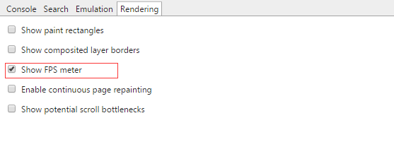
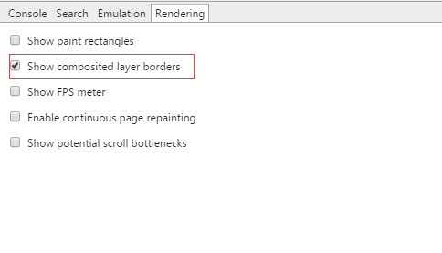

# Web动画性能介绍
在谈动画性能之前，先介绍一些概念。

## 帧率（FPS）
帧率（FPS）：描述每秒播放的帧数，单位为 Hz 或者 frame/s （帧/秒）。

理论上说，FPS越高，动画会越流畅，但是，因为大部分的显示器刷新频率是 60Hz，当动画的FPS超过 60Hz 时，会出现[画面撕裂](http://zh.wikipedia.org/wiki/%E7%95%AB%E9%9D%A2%E6%92%95%E8%A3%82)现象（显示器会把两个或更多的帧显示在同一画面上）。所以通常来讲 FPS 为 60frame/s 时动画效果最好，也就是每帧16.67ms，在浏览器中要减去渲染时间1ms左右，得到的结果是每帧时间大概15ms。

如果用 setInterval 来做动画，每帧时间大概设置成13ms（jQuery 用的 13ms）。因为用 setInterval 会有1ms左右的延时。当然在高级浏览器中，当然是用 requestAnimationFrame 来做动画啦。

在Chrome中查看帧率    

## 网页不同帧率的体验
* 帧率能够达到50~60fps的动画将会相当流畅，让人倍感舒适。
* 帧率在30～50fps之间的动画，因各人敏感程度不同，舒适度因人而异。
* 帧率在30fps以下的动画，让人感觉到明显的卡顿和不适感。
* 帧率波动很大的动画，亦会使人感觉到卡顿。

## 动画的流畅程度具备的特点
* 帧率高（接近60fps最佳）
* 帧率稳定，波动少（极少出现跳帧现象）

## 浏览器从DOM到渲染到页面上的过程
浏览器在渲染一个页面时，会将页面分为很多个图层，图层有大有小，每个图层上有一个或多个节点。在渲染DOM的时候，浏览器所做的工作实际上是：
1. 获取 DOM 并将其分割为多个层
1. 将每个层独立的绘制进位图中
1. 将层作为纹理上传至 GPU
1. 复合多个层来生成最终的屏幕图像

当 Chrome 首次为一个 web 页面创建一个帧(frame)时，以上步骤都需要执行。但对于以后出现的帧可以走些捷径：

* 如果某些特定 CSS 属性变化，并不需要发生重绘。Chrome 可以使用早已作为纹理而存在于 GPU 中的层来重新复合，但会使用不同的复合属性(例如，出现在不同的位置，拥有不同的透明度等等)。
* 如果层的部分失效，它会被重绘并且重新上传。如果它的内容保持不变但是复合属性发生变化(例如，层被转化或透明度发生变化)，Chrome 可以让层保留在 GPU 中，并通过重新复合来生成一个新的帧。

如果图层中某个元素需要重绘，那么整个图层都需要重绘。    

Chrome 中，图层分为 RenderLayer(负责 DOM 子树)，GraphicsLayer(负责 RenderLayer 的子树)。    
只有 GraphicsLayer 是作为纹理(texture)上传给 GPU 的。

## 硬件加速
借助于显卡的优势改变了渲染方式，被称为硬件加速(hardware acceleration)。

改变了渲染方式是指，对硬件加速的元素以transform的方式进行位移(translate)、旋转(rotate)、缩放(scale)时，这些操作会由GPU来处理，而不会触发浏览器的重绘（CPU处理）。

## 优化方式
### 减少重绘和重排
具体见 [Rendering: repaint, reflow/relayout, restyle](http://www.phpied.com/rendering-repaint-reflowrelayout-restyle/)

### 使用硬件加速
生成复合层(composited layer/GraphicsLayer)的方式。    
对于普通元素（除去Video，iframe，Flash等插件），通过设置
* transform:translate3d, translate 或perspective(透视)属性
* position:fixed
可以生成复合层(composited layer)。对复合层用设置transform的方式进行位移(translate)、旋转(rotate)、缩放(scale)将不会触发浏览器重绘，这部分工作会由GPU来处理。    
注意：如果对复合层用设置margin，padding或left,top来进行位移，width，height来进行缩放还是会触发浏览器重绘。

据说，[Firefox和IE会硬件加速所有的元素](http://stackoverflow.com/questions/9068132/why-arent-browsers-smart-enough-to-hardware-accelerate-without-tricks)。

### 用CSS3动画时，使用绘制效率比较高的属性
* 改变位置
* 改变大小
* 旋转
* 改变透明度（透明度改变不会触发重绘哦）

在chrome浏览器中查看复合层的方式为    
    
页面上的复合层会有黄色边框。

待续（Canvas，SVG里做动画的效率，JS的一些动画优化库）

## 参考
* [动画初探](https://github.com/imsobear/blog/issues/39)
* [Web动画性能指南](http://alexorz.github.io/animation-performance-guide/)
* [前端性能优化（CSS动画篇）](http://segmentfault.com/a/1190000000490328)
* [Accelerated Rendering in Chrome](http://www.html5rocks.com/zh/tutorials/speed/layers/)

## 拓展阅读
* [消除疑问：CSS动画 VS JavaScript](https://github.com/classicemi/blog/issues/3)
* [CSS Triggers...](http://csstriggers.com/) 样式新建或改变时，会触发哪些行为（重绘，重排，复合）的一个列表
* http://www.chromium.org/developers/design-documents/gpu-accelerated-compositing-in-chrome
* [CSS硬件加速的好与坏](http://efe.baidu.com/blog/hardware-accelerated-css-the-nice-vs-the-naughty/)
