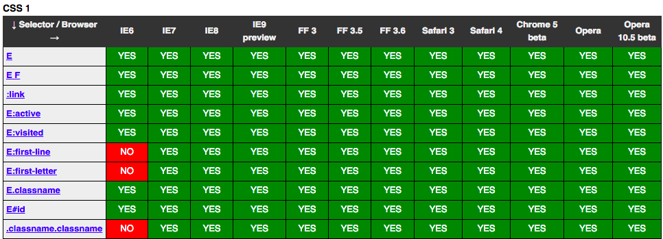
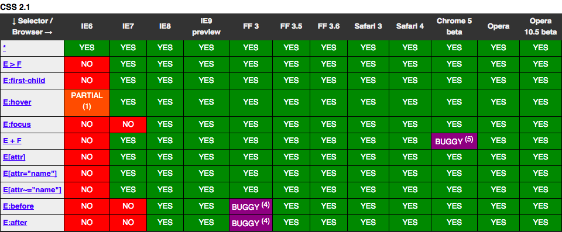
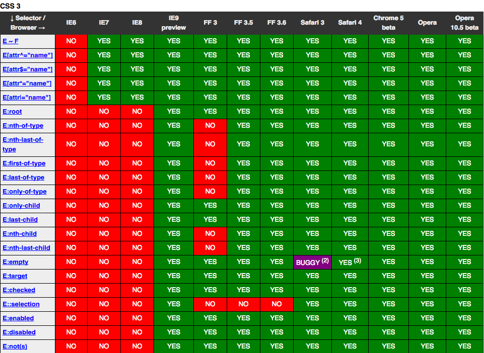

# CSS 选择器
用来选择页面上择需要添加样式的元素。

## 目录
* 选择器
	* [基本选择器](#basic)
	* [层次选择器](#descendant-class)
	* [伪类选择器](#pseudo-class)
	* [属性选择器](#attribute)
	* [伪元素选择器](#pseudo-elem)
* [选择器权重](#selector-weight)
* [选择器的读取顺序](#match-rule)
* [选择器的浏览器兼容性](#compatibility)
* [Efficiently Rendering CSS（高效的写选择器）](https://css-tricks.com/efficiently-rendering-css/)
* [作业](#homework)

## <a name='basic'>基本选择器</a>
基本选择器是css中使用最频繁，最基础，也是CSS中最早定义的选择器。兼容主流浏览器(IE6+,FF,Chrome等)。

### 通配选择器
选择所有html元素。用法`*`。
注：有人说，通配选择器比较影响效率。但貌似不是这样的，见
* [关于css通配符性能问题不完全测试](http://i.wanz.im/2012/01/03/performance_testing_about_css_universal_selector/)
* [CSS通用元素选择器的都市流言](http://shawphy.com/2010/11/css-universal-selector.html)

### 元素(element)选择器
根据元素的名称选元素。用`elementName`。
如，要让所有p元素的文字变为红色，可使用
```
p {color:#f00;}
```

### id选择器
根据元素的id选元素。用`#id`。
注：页面中不应该存在id一样的两个或多个元素。

### 类选择器
根据元素的类名来选元素。用`.className`。
注:一个元素可以有多个类名，类名之间用空格分隔。如:
```
<p class="out-look pull-right">...</p>
<style>
.out-look{color:#F60;font-size: 16px;}
.pull-right{float: right;}
</style>
```
上面代码中的p元素会同时应用`.out-look`和`.pull-right`里的样式。

### 群组选择器
将每一个选择器匹配的元素集合并。用法: `selector1,selector2,...,selectorN`。

## <a name="descendant-class">层次选择器</a>
### 派生选择器
选择元素下的所有元素。    
语法 `上下文选择元素 元素`
比方说，如果您希望只对 h1 元素中的 em 元素应用样式，可以这样写：
```
h1 em {color:red;}
```

### 子元素选择器
选择元素下的第一层子元素。    
语法 `父元素 > 子元素`    
浏览器兼容性:IE8+。


## <a name="pseudo-class">伪类选择器</a>
伪类选择器分为动态伪类,UI伪类和:nth选择器
### 动态伪类
因为这些伪类并不存在于HTML中,而只有当用户和网站交互的时候才能体现出来，动态伪类包含两种，第一种是我们在链接中常看到的锚点伪类，如":link",":visited";另外一种被称作用户行为伪类，如“:hover”,":active"和":focus"。

#### 锚点伪类
* :link 链接没有被访问
* :visited 链接被访问后

### 用户行为伪类
* :hover 用户把鼠标移动到元素上面时的效果。在手机上，用该伪类，手指移入时，或生效，移出时，不会失效，要用 `:active` 代替。
* :active 用户点击元素那一下的效果（正发生在点的那一下，松开鼠标左键此动作也就完成了）。在移动端上，用该伪类，可以模拟手指移入的效果。
* :focus 元素获得焦点。通常是表单元素。

锚点元素可以设置:hover，:active，:link和:visited四个伪类，其写的前后顺序必须是Link--visited--hover--active，即爱恨原则LoVe/HAte。否则，有些伪类的效果会永远不能生效。

## UI元素状态伪类
我们把":enabled",":disabled",":checked"伪类称为UI元素状态伪类，这些主要是针对于HTML中的Form元素操作，最常见的比如我们"type="text"有enable和disabled两种状态，前者为可写状态后者为不可状态；另外"type="radio"和"type="checkbox""有"checked"和"unchecked"两种状态

## :nth选择器
CSS3选择器最新部分，有人也称这种选择器为CSS3结构类

* :fist-child选择某个元素的第一个子元素；
* :last-child选择某个元素的最后一个子元素；
* :nth-child()选择某个元素的一个或多个特定的子元素；
* :nth-last-child()选择某个元素的一个或多个特定的子元素，从这个元素的最后一个子元素开始算；
* :nth-of-type()选择指定的元素；
* :nth-last-of-type()选择指定的元素，从元素的最后一个开始计算；
* :first-of-type选择一个上级元素下的第一个同类子元素；
* :last-of-type选择一个上级元素的最后一个同类子元素；
* :only-child选择的元素是它的父元素的唯一一个了元素；
* :only-of-type选择一个元素是它的上级元素的唯一一个相同类型的子元素；
* :empty选择的元素里面没有任何内容

### 拓展阅读
* [Mastering the :nth-child](http://nthmaster.com/)

## <a name="attribute">属性选择器</a>
根据属性来选元素。    
语法 `[属性名=属性值]`    
其中，    
* 属性值为可选的。若缺省属性值，则选择包含该属性的元素
* 属性值支持类似正则的写法，如：
	* `[abc^="def"]`表示 选择 abc 属性值以 "def" 开头的所有元素
	* `[abc$="def"]`表示 选择 abc 属性值以 "def" 结尾的所有元素
	* `[abc*="def"]`表示 选择 abc 属性值中包含子串 "def" 的所有元素

## <a name="pseudo-elem">伪元素选择器</a>
* `:before` 在元素之前添加内容
* `:after` 在元素之后添加内容
* `:first-line`  向文本的首行添加特殊样式
* `:first-letter` 向文本的第一个字母添加特殊样式
* `::-webkit-input-placeholder` 设置 placeholder


## <a name="selector-weight">选择器权重</a>
某条样式的是否被采用，取决于：该样式是否是同类样式中，权重得分最大的。

各类选择器的权重得分
* 带 !important 的规则得分是最高的
* 行内样式（style="..."）1000分
* ID选择器 100分
* 类选择器，伪类选择器，属性选择器 10分
* 标签选择器，伪元素选择器 1分
* 通配选择器 0分
* 继承和浏览器默认的的样式的得分是最低的

更多可查看 http://css-tricks.com/specifics-on-css-specificity/

## <a name="match-rule">选择器的读取顺序</a>
CSS选择器的读取顺序是从右向左。    
原因是从右向左的规则要比从左向右的高效。    
如果正向解析，例如「div div p em」，我们首先就要检查当前元素到 html 的整条路径，找到最上层的 div，再往下找，如果遇到不匹配就必须回到最上层那个 div，往下再去匹配选择器中的第一个 div，回溯若干次才能确定匹配与否，效率很低。

逆向匹配则不同，如果当前的 DOM 元素是 div，而不是 selector 最后的 em，那只要一步就能排除。只有在匹配时，才会不断向上找父节点进行验证。

更详细的寒冬的[解释](http://v.youku.com/v_show/id_XMjMzMzU2NDc2.html)


## <a name="compatibility">兼容性</a>




## <a name="homework">作业</a>
写满足以下条件的选择器
* id为`img-list`的子元素中类名为`img-item`的`span`元素
* 类名不为`not-normal-input`的文本框(`<input type="text">`)元素的获得焦点状态
* 在父元素中倒数第2个`a`元素
* 在父元素中第3个整数倍，但不包括0，3的`a`元素

## 参考
* http://www.w3schools.com/css/css_selectors.asp
* [《图解CSS3：核心技术与案例实战》](http://www.w3cplus.com/book-comment.html)
* [选择器浏览器兼容性](http://kimblim.dk/css-tests/selectors/)

## 拓展阅读
* [30个你必须记住的CSS选择符](http://yanhaijing.com/css/2014/01/04/the-30-css-selectors-you-must-memorize/)
* [The Current Generation of CSS3 Selectors](http://www.sitepoint.com/current-generation-css3-selectors/)
* [The Future Generation of CSS Selectors: Level 4](http://www.sitepoint.com/future-generation-css-selectors-level-4)
