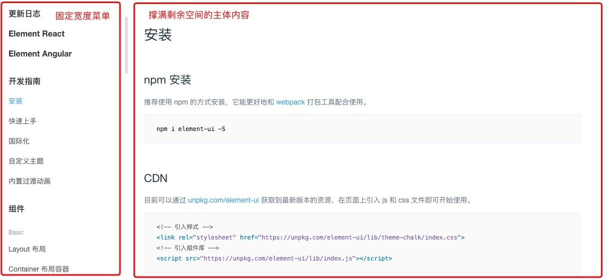

# 17个场景，带你掌握CSS布局
CSS 布局本质就是控制元素的位置和大小。比如这样的布局：元素宽960px，水平居中。水平居中是位置。宽960px是大小。又如这样的布局：两个元素在一行，左侧元素固定宽200px，右侧元素撑满剩余空间。两个元素在一行是位置。固定宽200px，撑满剩余空间是大小。

下面，我们从位置和大小两个方面，结合场景来看CSS布局。

## 大小
大小指元素的占的空间。空间包含水平空间和垂直空间。大部分情况下，
* 所占水平空间 = width值 + 左右padding值 + 左右border宽度值
* 所占垂直空间 = height值 + 上下padding值 + 上下border宽度值

这其实满反直觉的。直觉认为：
* 所占水平空间 = width值
* 所占垂直空间 = height值

要让上面的等式成立，只需给元素设置样式 `box-sizing: border-box`。这样做，算空间比较容易。因此，我们常常能在项目的通用样式中发现这样的代码:
```css
* {
  box-sizing: border-box;
}
```

`box-sizing` 设置的是元素的盒模型(Box Model)。页面上的每个元素都被描绘成矩形盒子，用这个盒子通过一个模型来描述其占用空间，这个模型称为盒模型。盒模型由 4 部分组成，从内到外分别是 内容(content)，内边距(padding)，边框(border)和外边框(margin)。


当 `box-sizing` 设置为 `border-box` 时，所占水平空间 = width值，内容宽度 = width值 - 左右padding值 - 左右边框宽度值。 例如: 
```css
box-sizing: border-box;
width: 100px;
padding-left: 10px;
```

所占水平空间是 100px，内容宽度值是 90px(width: 100px - padding-left: 10px)。把 padding-left 改成 20px。所占水平空间仍然是 100px，内容宽度值是 80px(width: 100px - padding-left: 20px)。

`box-sizing` 的默认值是 `content-box`, 水平空间 = width值 + 左右padding值 + 左右border宽度值。

### 场景01 元素的宽高是固定值
给元素设置固定的宽高，只需设置。如: 
```css
width: 100px;
height: 100px;
```

**注意**：给行内元素设置宽高值不会生效。常见的行内元素有`a`,`strong`,`span`。给元素设置样式：`display: inline`，会将该元素变为行内元素。因此，当发现给元素设置宽高无效时，检查这元素是否是行内元素。

### 场景02 全屏：元素宽高与浏览器可视区域大小一致
可以用单位 vw 和 vh 实现。1vw 等于浏览器可视区域宽度的1%，1vh 等于浏览器可视区域高度的1%。因此，实现全屏只需要这么写：
```css
{
  width: 100vw;
  height: 100vh;
}
```

主流浏览器均兼容 vw 和 vh。PC端，IE9及以上支持，移动端 ios 8 以上以及 Android 4.4 以上获得支持，并且在微信 x5 内核中也得到完美的全面支持。

### 场景03 撑满父元素的剩余可用宽度
撑满父元素的剩余可用宽度的常见的具体场景是：页面左右结构，左侧是固定宽度的菜单导航，右侧是撑满剩余部分的主题内容。如下图：


下面列举2种实现方法。无须兼容旧浏览器的用方法1，否则用方法2。

#### 方法1 Flex 布局
可以用 Flex 布局中的 `flex-grow` 来实现宽度撑满父元素的剩余部分。

我们先来简单介绍下 Flex 布局。Flex 是 Flexible Box 的缩写，意为"弹性布局"。该布局能为盒模型提供最大的灵活性，是目前主流的布局技术。

采用 Flex 布局的元素，称为 Flex 容器（flex container），简称"容器"。将元素设置为 Flex 容器，只需设置样式`display: flex;`或`display: inline-flex;`。它的所有子元素自动成为容器成员，称为 Flex 项目（flex item），简称"项目"。

`flex-grow` 属性定义项目的放大比例，默认为0，即如果存在剩余空间，也不放大。值大于0时，就会撑满父元素宽度的剩余部分。具体实现如下：

HTML：
```html
<div class="container">
  <div class="left">固定宽度的菜单导航</div>
  <div class="right">撑满剩余部分的主题内容</div>
</div>
```

CSS
```css
.ly {
  display: flex;
}
.left {
  width: 300px;
}
.right: {
  flex-grow: 1;
}
```

垂直方向，如果要实现撑满父元素的剩余可用高度，只需在Flex容器上加样式`flex-direction: column`，并设置好高度。撑满父元素的剩余可用高度元素上加样式`flex-grow: 1`。是不是很容易~

#### 方法2 table 布局
table元素中的 td，如果没有设置宽度，其宽度是弹性的：table的宽度大，td的宽度也变大；table的宽度小，td的宽度也变小。用 table 这特性，正好可以实现我们的场景。但table 的语义是来展示二维数据的，而我们展示的并不是二维数据。幸运的是，CSS 支持模拟 table 的这特性。做法：在父元素上设置`display:table`，子元素设置 `display:table-cell`。 

HTML：
```html
<div class="container">
  <div class="left">固定宽度的菜单导航</div>
  <div class="right">撑满剩余部分的主题内容</div>
</div>
```

CSS
```css
.container {
  display: table;
  width: 100%;
}
.left,.right {
  display:table-cell;
}
.left {
  width: 300px;
}
```

### 场景04 父元素剩余空间小于元素宽度，元素宽度变小
可以用 Flex 布局中的 `flex-shirk` 实现。flex-shrink 属性定义了项目的缩小比例，默认为1，即如果空间不足，该项目将缩小。

如果要兼容旧的浏览器，也可以用 table 布局，具体见上个场景的方法2。

### 场景05 响应式宽高：元素的宽度和高度和设备的大小有关
移动设备有大有小。为了提高用户体验，在大的设备上，元素就显示的大一点，小的设备，元素就显示的小一点。主要有两种方式来实现：js配合rem实现和媒体查询。

这两种方法，都需要加上设置 viewport 的代码：
```html
<meta name="viewport" content="width=device-width, initial-scale=1.0">
```

想了解这代码的原理，可以阅读[在移动浏览器中使用viewport元标签控制布局](https://developer.mozilla.org/zh-CN/docs/Mobile/Viewport_meta_tag)。

### 方法1: js配合rem
rem 是尺寸单位。 1rem = 根元素（即html元素）的字体大小值。当根元素的字体大小变化，1rem的大小也会跟着变。如果元素的宽高值用rem做单位，用js获取当前设备的宽度来设置根元素的字体大小，那么，就能实现元素的宽高和设备的大小有关。

为了能将设计稿中的 px 方便的转换为页面中 rem，我设置 1rem 为 宽度为 750px 的设计稿中的 100px。代码如下:

```js
;
(function(win) {
  var doc = win.document;
  var docEl = doc.documentElement;
  var tid;

  function refreshRem() {
    var width = docEl.getBoundingClientRect().width;
    if (width > 540) { // 最大宽度
        width = 540;
    }
    var rem = width / 7.5; 
    docEl.style.fontSize = rem + 'px';
  }

  win.addEventListener('resize', function() {
      clearTimeout(tid);
      tid = setTimeout(refreshRem, 300);
  }, false);
  win.addEventListener('pageshow', function(e) {
      if (e.persisted) {
          clearTimeout(tid);
          tid = setTimeout(refreshRem, 300);
      }
  }, false);

  refreshRem();
})(window);
```

#### 方法2: 媒体查询(Media Queries)
通过媒体查询，我们对不同设备的特性来应用不同的样式。支持的设备特性包括：设备宽度，设备高度，设备是处于横屏还是竖屏等。写法如下：
```css
/* 括号里的是设备特性。 */
@media (max-width: 600px) {
  /* 设备宽度小于600px时，才左右下面的样式 */
  .facet_sidebar {
    display: none;
  }
}
```

通过媒体查询，给不同的设备宽度设置不同的样式，就能实现元素的宽高和设备的大小有关。如
```css
.tar {
  width: 110px;
}
@media (max-width: 600px) {
  .tar {
    width: 100px;
  }
}
@media (max-width: 500px) {
  .tar {
    width: 90px;
  }
}
@media (max-width: 500px) {
  .tar {
    width: 80px;
  }
}
```

控制元素的大小是离散的，比较糙。

### 场景06 宽高值是表达式的计算结果
怎么理解：表达式的计算结果？如，我们需要实现，一个元素的高度是:浏览器可视区域高度-10px。浏览器可视区域高度-10px 就是表达式的计算结果。

`calc()` 允许在声明 CSS 属性值时执行一些计算。语法:
```css
css属性: calc(表达式);
```

实现元素的高度是:浏览器可视区域高度-10px。只要给元素加下面的样式：
```css
height: calc(100vh - 10px);
```

注意：
* 操作符 `-` 的两边必须有空格。
* 表达式只支持 加(+)，减(-)，乘(\*)，除(/)操作。

主流浏览器均支持`calc()`。详细的兼容性情况见[Can I use calc](https://caniuse.com/#search=calc)。

如果要兼容不支持的浏览器，可以用 js 来实现。如，要设置元素的高度是：比浏览器可视区域小10px。只需在DOM加载好后，执行
```js
document.querySelector('要设置的元素选择器').style.height = `${window.innerHeight - 10}px`
```

## 位置
### 场景07 文字的水平对齐
文字的水平左对齐，居中对齐，右对齐。可以用 `text-align` 来实现。代码如下：
```css
text-align: left; // 左对齐
text-align: center; // 居中对齐
text-align: right; // 右对齐
```

### 场景08 文字的垂直居中
单行文本和多行文本的垂直居中的处理方式不一样。

单行文本的垂直居中。只需设置高度等于行高。如
```css
height: 25px;
line-height: 25px;
```

多行文本的垂直居中可以用 "场景12 多个元素的垂直居中" 中的方法。

### 场景09 多个块级元素的在一行或多行中显示
用 Flex 布局可以实现多个块级元素的在一行或多行中显示。Flex 布局的 Flex项目，会在一行中显示。多行显示的方法是，在 Flex 容器上设置 `flex-wrap: wrap`。完整代码: 
```css
.container {
  display: flex;
  flex-wrap: wrap;
}
```

用 inline-block, float 等技术也可以实现多个元素在一行中显示。这边就不介绍了。

### 场景10 多个元素的水平居中
用 Flex 布局可以实现多个元素的水平居中。代码：
```css
.container {
  display: flex;
  justify-content: center;
}
```

如果是一个固定宽度元素的水平居中，可以用 
```css
width: 960px; /* 必须设置 */
margin-left: auto;
margin-right: auto;
```

### 场景11 多个元素的水平两端对齐
用 Flex 布局可以实现多个元素的水平两端对齐。代码：
```css
.container {
  display: flex;
  justify-content: space-between;
}
```

还有2个分配多个元素间的方式，也可以了解下：
* `justify-content: space-around`: 每行上均匀分配弹性元素。相邻元素间距离相同。每行第一个元素到行首的距离和每行最后一个元素到行尾的距离将会是相邻元素之间距离的一半。
* `justify-content: space-evenly`: 每行上均匀分配弹性元素。相邻元素间距离，第一个元素距行首的间距，最后一个元素距行尾的间距均相同。注意：IE 不支持该样式。


### 场景12 多个元素的垂直居中
用 Flex 布局可以实现多个元素的垂直居中。代码：
```css
.container {
  display: flex;
  align-items: center;
}
```

### 场景13 元素始终位于父元素右上角
可以用 绝对定位 来实现元素始终位于父元素右上角。

用绝对定位我们先了解position的相关知识。 CSS 的position属性用于指定一个元素在文档中的定位方式。top，right，bottom 和 left 属性则决定了该元素的最终位置。常见的定位类型有：
* 定位元素（positioned element）是其position的值不为static的元素。position的默认值为static。
* 相对定位元素（relatively positioned element）是position的值为 relative 的元素。
* 绝对定位元素（absolutely positioned element）是position的值为 absolute 或 fixed 的元素。
* 粘性定位元素（stickily positioned element）是position的值为 sticky 的元素。

实现元素始终位于父元素右上角的做法：将父元素设置为定位元素，子元素设置为绝对定位元素即可。代码：
HTML:
```html
```

```css
```

### 场景14 元素始终位于页面的右下角
PC 的返回顶部。 `positon: fixed`。

### 场景15 绝对定位元素的水平居中

### 场景16 绝对定位元素的垂直居中

### 场景17 文字环绕图片
浮动 `float`。


## 总结一下
掌握CSS布局，要掌握以下几点重点：
* boxing-sizing的值为 border-box 和 content-box 对应的空间计算规则是怎样的。
* 给行内元素设置宽高值不会生效。
* 实现单行文字的垂直居中，只需设置高度等于行高。
* 多个元素占一行(或列)或多行(或列)，居中对齐，居右对齐，弹性的宽度或高度。可以用Flex布局来实现。旧浏览器可以用inline-block来实现。
* 元素相对父元素定位或相对页面定位。可以用Position来实现。
* 实现宽高和设备宽度有关。可以用 js 配合 rem 实现。

## 参考&推荐阅读
* [Flex 布局教程：语法篇](http://www.ruanyifeng.com/blog/2015/07/flex-grammar.html)
* [学习CSS布局](http://zh.learnlayout.com/)
